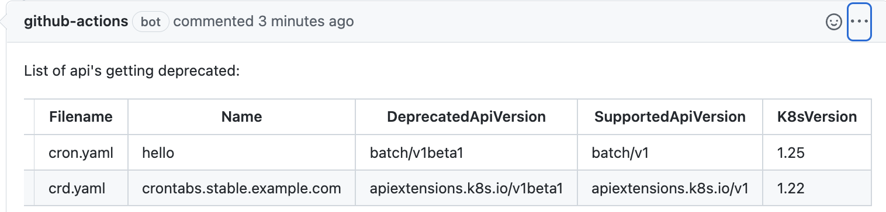

<h1 align="center">
  <p align="center">Kube-depre</p>
</h1>

<div align="center">
  <a href="hhttps://github.com/anzx/platform-secret-management/actions/workflows/ci.yaml" alt="Build"></a>
  <a href="https://codecov.io/gh/maheshrayas/kube-depre" alt="Lint"></a>
</div>


## Motivation

Given that kubernetes frequently deprecates apiVersions, we want to check for the resources with deprecated apiVersions in cluster or files or as a part of Continous Integration pipeline (Github Actions) so that we can update the apiVersion in manifest before the cluster is upgraded.

`kube-depre` is a simple CLI tool that allows us to find such deprecated apiVersion in Kubernetes cluster, or in files and as well integrated with github actions to report the Deprecated Apis as a comment on Pull Request.

## Installation

Supports only Linux and Mac

1. Download from the [Release](https://github.com/maheshrayas/kube-depre/releases)

OR

2.

```bash
curl -L https://raw.githubusercontent.com/maheshrayas/kube-depre/main/release/install.sh | sh -

```

## How to use

### Prerequisite if validating against the K8s cluster

kube-depre by default looks for `~/.kube/config` for kuberenetes configuration. If the configuration is stored in other file location, set that location in the `KUBECONFIG` environment variable.

```bash
export KUBECONFIG={config-location}
```

### CLI Supported Args

```bash
kube-depre 0.1.14

USAGE:
    kube-depre [OPTIONS]

OPTIONS:
    -d, --debug
            supply --debug to print the debug information

    -f, --file <FILE>
            supply -f or --file "Manifest file directory". if -f not supplied, it will by default
            query the cluster

    -h, --help
            Print help information

    -o, --output <OUTPUT>
            Output format for the list of deprecated APIs [default: table] [possible values: table,
            csv]

    -t, --target-version <TARGET_VERSION>
            list of deprecated APIs in a specific kubernetes version, -t 1.22. If -t not supplied,
            it will query for versions : 1.16, 1.22, 1.25, 1.26, 1.27, custom

    -V, --version
            Print version information
```

### Commands

#### Check for deprecated APIs in cluster

```bash
# check for list for depreacted Apis in the cluster in K8s 1.22 and output will be printed on terminal
./kube-depre -t 1.22

# check for list for depreacted Apis in the cluster in K8s 1.22 & 1.24 and output will be printed on terminal, it can be outputted to csv as well
./kube-depre -t 1.22,1.24

# check for list for depreacted Apis in the cluster in K8s 1.22 and output will be in csv format
./kube-depre -t 1.22 -o csv

# check for list for depreacted Apis in the cluster for non default K8s Custom resouces, for example: Istio, SecretStoreCSI etc.
./kube-depre -t custom

# check for list for depreacted Apis in the cluster in K8s version 1.16,1.22,1.24,1.25  and output will be in csv format
./kube-depre -o csv

```

#### Check for deprecated APIs in files

```bash
# check for list for depreacted Apis in the supplied file directory in K8s 1.22 and output will be printed on terminal
./kube-depre -t 1.22 -f $(pwd)/tests/data

# check for list for depreacted Apis in the supplied file directory in K8s 1.22 & 1.24 and output will be printed on terminal, it can be outputted to csv as well
./kube-depre -t 1.22,1.24

# check for list for depreacted Apis in the supplied file directory in K8s 1.22 and output will be in csv format
./kube-depre -t 1.22 -o csv -f $(pwd)/tests/data

# check for list for depreacted Apis in the files for non default K8s Kinds or Custom resouces, for example: Istio, SecretStoreCSI etc.
./kube-depre -t custom -o csv -f $(pwd)/tests/data

# check for list for depreacted Apis in the supplied file directory in K8s version 1.16,1.22,1.24,1.25  and output will be in csv format
./kube-depre -o csv -f $(pwd)/tests/data

```
**If you want to add additional kinds(non default), please feel free to PR [here](https://github.com/maheshrayas/k8s_deprecated_api/blob/main/vcustom/data.json)** 

#### Check for deprecated APIs as a part of Pull request in Github

Refer github [workflow](./.github/workflows/check_deprecated.yaml) on how to scan kubernetes manifests in github repo and comment on PR with list of Deprecated APIs.




